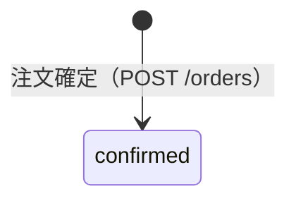
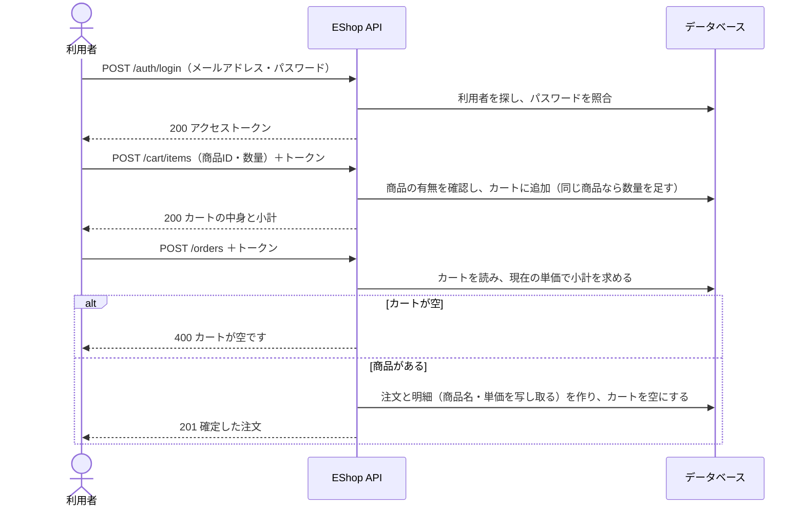
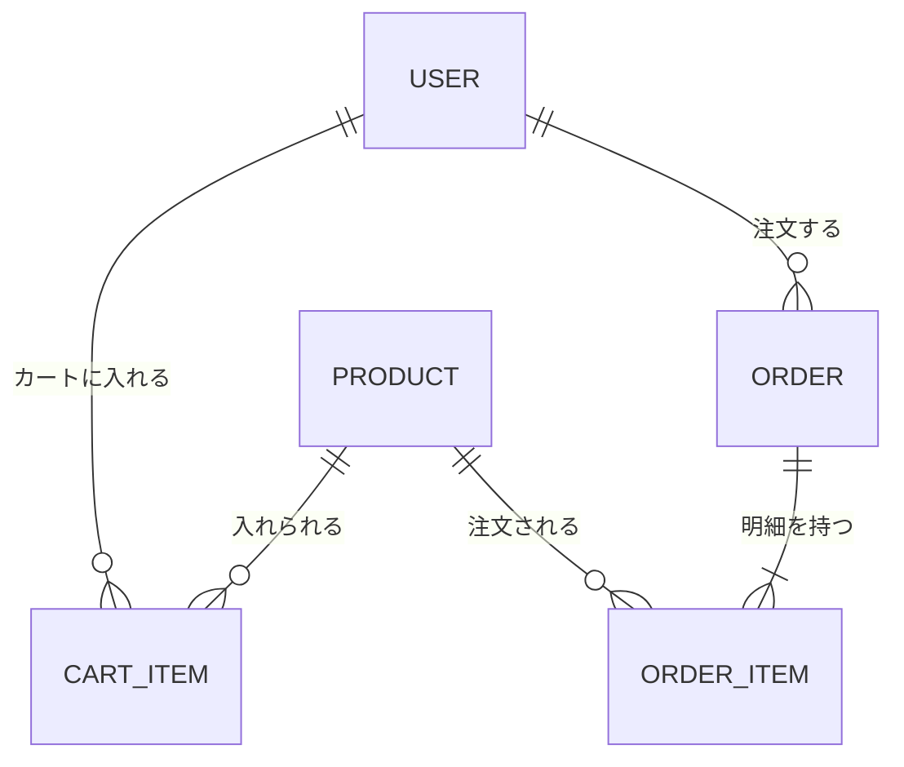

# 基本設計書（EShop）

ECサイトEShopのバックエンドの基本設計書である。**機能を追加するときは、この設計書に追記する。**

## 変更履歴

| 版  | 内容                                                   |
| :-- | :----------------------------------------------------- |
| 1.0 | 初版（認証・商品一覧・カート・注文確定）               |

## 機能を追加するときの書き方

- 章は増やさない。追加する機能の内容を、それぞれの章に書き足す
- 新しい機能は「3. 機能一覧」に行を足し、実現するエンドポイントを書く
- 新しいエンドポイントは「9. 外部インタフェース（API）」に節を足し、一覧にも行を足す
- 既存のエンドポイントの動きを変えるときは、その節を書き換え、変わる点（追加する項目・エラー）を明記する
- 新しいテーブルや列は「8. データモデル」の表とER図の両方に足す
- 状況とステータスコードの対応は「10. エラー一覧」にも足す
- 決めた方針とその理由は、関係する章（業務ルール・スコープなど）に書く
- 変更履歴に1行足す
- 書くのは基本設計の範囲まで（規則・入出力・流れ）。SQLやクラスの作りは書かない

## 1. 概要・スコープ

### 1-1. 目的

一般の利用者が商品を選んでカートに入れ、注文を確定できるECサイトのバックエンドAPIを提供する。

### 1-2. 対象範囲

| 対象                     | 内容                                           |
| :----------------------- | :--------------------------------------------- |
| バックエンドAPI          | 本書の対象。`backend/`                         |
| 画面（`frontend/`）      | 対象外（本書では扱わない）                     |

### 1-3. スコープ外

| 項目                         | 理由・補足                                         |
| :--------------------------- | :------------------------------------------------- |
| 利用者の新規登録・退会       | 現行の版では利用者は初期データで用意する           |
| 商品の登録・変更（管理機能） | 現行の版では商品は初期データで用意する             |
| 決済・配送                   | 注文確定までを扱う。支払いと配送は扱わない         |
| 注文の参照・取り消し         | 現行の版には無い                                   |
| 在庫管理                     | 在庫数は持たない。数量の上限も設けない             |

## 2. 用語

| 用語     | 意味                                                             |
| :------- | :--------------------------------------------------------------- |
| 利用者   | ログインしてカートと注文を使う人。本書の「ユーザー」と同じ       |
| カート   | 注文を確定する前に、利用者ごとに商品と数量を入れておく場所       |
| 小計     | 商品ごとの`単価 × 数量`の合計（円）                              |
| 注文確定 | カートの中身を注文として記録し、カートを空にすること             |

## 3. 機能一覧

| No. | 機能         | 概要                                               | エンドポイント           |
| --: | :----------- | :------------------------------------------------- | :----------------------- |
|  1  | ログイン     | メールアドレスとパスワードで認証し、トークンを発行 | `POST /auth/login`       |
|  2  | 商品一覧     | 登録されている商品を一覧で返す                     | `GET /products`          |
|  3  | カートに追加 | 商品と数量をカートに入れる                         | `POST /cart/items`       |
|  4  | カートの確認 | カートの中身と小計を返す                           | `GET /cart`              |
|  5  | 注文確定     | カートの中身で注文を確定する                       | `POST /orders`           |
|  6  | 稼働確認     | サーバーが動いているかを返す                       | `GET /`                  |

## 4. 業務ルール

### 4-1. 金額

- 金額はすべて整数（円）で扱う
- カートの小計は、各商品の**現在の**単価で求める（`Σ 単価 × 数量`）
- 注文確定時も、その時点の単価で小計を求め直す。確定した注文には、そのときの商品名と単価を写し取って残す。あとで商品の価格が変わっても、確定した注文の金額は変わらない

### 4-2. カート

- 利用者ごとに1つ。同じ商品は1行にまとめ、追加するたびに数量を足す
- 数量は1以上。上限は設けない
- 注文を確定するとカートは空になる

### 4-3. 注文の状態

注文は確定したときに作られ、状態は`confirmed`（確定済み）になる。現行の版では、ほかの状態へは移らない。



## 5. 権限（認可）

| 操作                         | 誰ができるか                                   |
| :--------------------------- | :--------------------------------------------- |
| ログイン・商品一覧・稼働確認 | 誰でも（ログイン不要）                         |
| カートに追加・カートの確認   | ログインした利用者。**自分のカートだけ**を扱う |
| 注文確定                     | ログインした利用者。**自分のカートだけ**を注文する |

- どの利用者のカートかは、リクエストの値ではなく、トークンのユーザーで決める。ほかの利用者のIDを指定して操作する手段は無い

## 6. セキュリティ

- パスワードはbcryptでハッシュ化して保存し、平文では持たない
- ログインに失敗したときは、メールアドレスとパスワードのどちらが違ったかを返さない（登録済みのメールアドレスを推測させないため）
- トークン（JWT）の署名鍵などの秘密情報は、コードに書かず`.env`に置く

## 7. 処理の流れ

カートに商品を入れて注文を確定するまでの流れ。



## 8. データモデル



### User（ユーザー）

| 項目              | 型           | 説明                                                     |
| :---------------- | :----------- | :------------------------------------------------------- |
| `id`              | 整数         | 主キー                                                   |
| `email`           | 文字列・一意 | ログインID                                               |
| `hashed_password` | 文字列       | bcryptでハッシュ化したパスワード                         |
| `member_rank`     | 文字列       | 会員ランク（既定は`general`）。現行の機能では使っていない |

### Product（商品）

| 項目       | 型     | 説明                   |
| :--------- | :----- | :--------------------- |
| `id`       | 整数   | 主キー                 |
| `name`     | 文字列 | 商品名                 |
| `price`    | 整数   | 単価（円）             |
| `category` | 文字列 | 商品カテゴリ           |
| `is_sale`  | 真偽値 | セール品か（既定は偽） |

### CartItem（カートの明細）

利用者ごとに、商品1種類につき1行を持つ。

| 項目         | 型   | 説明                  |
| :----------- | :--- | :-------------------- |
| `id`         | 整数 | 主キー                |
| `user_id`    | 整数 | ユーザー（`User.id`） |
| `product_id` | 整数 | 商品（`Product.id`）  |
| `quantity`   | 整数 | 数量                  |

### Order（注文）

| 項目         | 型     | 説明                              |
| :----------- | :----- | :-------------------------------- |
| `id`         | 整数   | 主キー                            |
| `user_id`    | 整数   | 注文したユーザー（`User.id`）     |
| `subtotal`   | 整数   | 注文確定時の小計（円）            |
| `status`     | 文字列 | 注文の状態（4-3）。確定時は`confirmed` |
| `created_at` | 日時   | 注文を確定した日時（UTC）         |

### OrderItem（注文の明細）

注文確定時点の商品名と単価を写し取って持つ（4-1）。

| 項目           | 型     | 説明                 |
| :------------- | :----- | :------------------- |
| `id`           | 整数   | 主キー               |
| `order_id`     | 整数   | 注文（`Order.id`）   |
| `product_id`   | 整数   | 商品（`Product.id`） |
| `product_name` | 文字列 | 確定時点の商品名     |
| `unit_price`   | 整数   | 確定時点の単価（円） |
| `quantity`     | 整数   | 数量                 |

## 9. 外部インタフェース（API）

### 9-1. 共通仕様

| 項目      | 内容                                                           |
| :-------- | :------------------------------------------------------------- |
| ベースURL | `http://127.0.0.1:8000`                                        |
| 形式      | リクエスト・レスポンスともJSON（UTF-8）                        |
| 日時      | UTCの日時をISO 8601形式の文字列で返す                          |
| API仕様書 | サーバー起動中は Swagger UI（`/docs`）で実際の定義を確認できる |

**認証**

- `POST /auth/login`でアクセストークン（JWT）を取得し、要認証のAPIではヘッダーに付ける
  ```text
  Authorization: Bearer <access_token>
  ```
- トークンの有効期限は60分（`.env`の`JWT_EXPIRE_MINUTES`で変わる）
- トークンには、ログインした利用者のメールアドレス（`sub`）と有効期限（`exp`）が入る

**エラーの返し方**

アプリが返すエラーは、`detail`に理由の文字列を入れて返す。

```json
{ "detail": "商品が見つかりません" }
```

リクエストの形式が合わない（必須項目が無い・型が違う・値の範囲外）ときは、フレームワークが**422**を返す。`detail`はエラーの配列になる（下の例は一部の項目を省略している）。

```json
{
  "detail": [
    { "type": "greater_than_equal", "loc": ["body", "quantity"], "msg": "Input should be greater than or equal to 1", "input": 0 }
  ]
}
```

状況ごとのステータスコードは「10. エラー一覧」にまとめる。

### 9-2. エンドポイント一覧

| メソッド | エンドポイント | 概要                       | 認証 |
| :------- | :------------- | :------------------------- | :--- |
| GET      | /              | 稼働確認                   | 不要 |
| POST     | /auth/login    | ログイン（JWT取得）        | 不要 |
| GET      | /products      | 商品一覧取得               | 不要 |
| POST     | /cart/items    | カートに商品追加           | 要   |
| GET      | /cart          | カート内容・小計取得       | 要   |
| POST     | /orders        | 注文確定（チェックアウト） | 要   |

### 9-3. GET /（稼働確認・認証不要）

レスポンス 200 OK

```json
{ "status": "ok" }
```

### 9-4. POST /auth/login（ログイン・認証不要）

リクエスト

```json
{ "email": "taro@example.com", "password": "your-password" }
```

| 項目       | 型     | 必須 | 説明           |
| :--------- | :----- | :--- | :------------- |
| `email`    | 文字列 | ○    | メールアドレス |
| `password` | 文字列 | ○    | パスワード     |

レスポンス 200 OK

```json
{ "access_token": "eyJhbGciOiJIUzI1NiIs...", "token_type": "bearer" }
```

### 9-5. GET /products（商品一覧取得・認証不要）

登録されているすべての商品を返す。並び順は指定しない。商品が無いときは空の配列を返す。

レスポンス 200 OK

```json
[
  { "id": 1, "name": "ワイヤレスマウス", "price": 2980, "category": "electronics", "is_sale": false },
  { "id": 3, "name": "モバイルバッテリー", "price": 3480, "category": "electronics", "is_sale": true }
]
```

### 9-6. POST /cart/items（カートに商品追加・要認証）

ログイン中の利用者のカートに商品を入れ、カートの内容を返す（4-2）。

リクエスト

```json
{ "product_id": 1, "quantity": 2 }
```

| 項目         | 型   | 必須 | 説明                   |
| :----------- | :--- | :--- | :--------------------- |
| `product_id` | 整数 | ○    | 商品のID               |
| `quantity`   | 整数 | －   | 数量。1以上。省略時は1 |

レスポンス 200 OK：`GET /cart`と同じ形で、追加後のカートを返す。

### 9-7. GET /cart（カート内容・小計取得・要認証）

ログイン中の利用者のカートと小計を返す。カートが空のときは`{"items": [], "subtotal": 0}`を返す。

レスポンス 200 OK

```json
{
  "items": [
    { "product_id": 1, "product_name": "ワイヤレスマウス", "unit_price": 2980, "quantity": 2 }
  ],
  "subtotal": 5960
}
```

| 項目                 | 説明                                |
| :------------------- | :---------------------------------- |
| `items[].unit_price` | 商品の**現在の**単価                |
| `subtotal`           | `unit_price × quantity`の合計（円） |

### 9-8. POST /orders（注文確定・要認証）

ログイン中の利用者のカートの中身で注文を確定する（処理の流れは7）。リクエストボディは無い。

レスポンス 201 Created

```json
{
  "id": 1,
  "status": "confirmed",
  "subtotal": 5960,
  "items": [
    { "product_id": 1, "product_name": "ワイヤレスマウス", "unit_price": 2980, "quantity": 2 }
  ],
  "created_at": "2026-10-01T01:23:45.678901"
}
```

## 10. エラー一覧

| エンドポイント           | 状況                                               | ステータス | `detail`                                           |
| :----------------------- | :------------------------------------------------- | :--------- | :------------------------------------------------- |
| 要認証のすべて           | `Authorization`ヘッダーが無い                      | 401        | `Not authenticated`                                |
| 要認証のすべて           | トークンが不正・期限切れ・該当する利用者がいない   | 401        | `認証情報が無効です`                               |
| `POST /auth/login`       | メールアドレスが未登録、またはパスワードが違う     | 401        | `メールアドレスまたはパスワードが正しくありません` |
| `POST /cart/items`       | `product_id`の商品が無い                           | 404        | `商品が見つかりません`                             |
| `POST /orders`           | カートが空                                         | 400        | `カートが空です`                                   |
| すべて                   | リクエストの形式が合わない（必須項目が無い・`quantity`が0以下 など） | 422 | （形式エラー。9-1）                     |

要認証のAPIで401を返すときは、`WWW-Authenticate: Bearer`ヘッダーも返す（ログイン失敗の401には付けない）。
